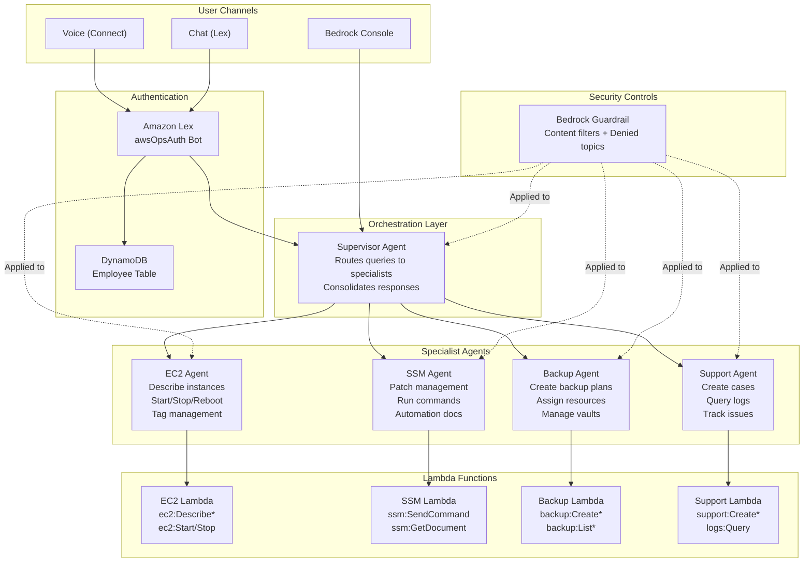

# Sample Multi-agent IT operations sample 

A sample demonstrating multi-agent collaboration with Amazon Bedrock, Amazon Connect and Amazon Lex to automate EC2, SSM, Backup, and Support operations using AWS Lambda.

## Business Use Cases

This sample demonstrates how organizations can:

- **Reduce Mean Time to Resolution (MTTR)**: Natural language interface for common operations tasks
- **Enable Self-Service IT Operations**: Allow authorized users to perform routine tasks without deep AWS expertise
- **Standardize Operations Workflows**: Consistent execution of patching, backup, and instance management
- **Integrate Voice/Chat Channels**: Amazon Connect integration for contact center operations support

Example scenarios:
- "List all EC2 instances tagged as production"
- "Patch all development instances with the latest security updates"
- "Create a backup plan for instances tagged Environment=Production"
- "Create a support case for high CPU utilization on instance i-1234abcd"

## Contributors

Aditya Ambati, Anand Krishna Varanasi, Bikash Chandra Rout, JAGDISH KOMAKULA, Ramu Jagini, T.V.R.L.Phani Kumar Dadi

## Architecture Overview



### Multi-Agent System (Amazon Bedrock)

- **Supervisor Agent**: Routes queries to specialized agents based on intent
- **EC2 Agent**: Instance lifecycle management (describe, start, stop, reboot)
- **SSM Agent**: Patch management, command execution, automation
- **Backup Agent**: AWS Backup plan creation and resource assignment
- **Support Agent**: AWS Support case creation and management

Each agent uses Claude 3.7 Sonnet with session memory and content guardrails.

### Contact Center Infrastructure

- Amazon Connect instance with SAML authentication
- Amazon Lex bots for voice/chat interaction
- Kinesis streams for contact trace records and agent events
- S3 buckets with KMS encryption for recordings and transcripts

## Sample Data Disclaimer

This project includes **FAKE sample data** for demonstration purposes only:

- Employee IDs: `EMP001`, `EMP002`, `EMP003`, `EMP004`, `EMP005`, `12345`
- Employee names and departments are fictional
- DynamoDB table is pre-populated during deployment

**For production use**: Replace the sample data population logic with integration to your identity provider or HR system.

## Prerequisites

- AWS CLI configured with appropriate permissions
- Node.js 14.x or later
- Python 3.12
- AWS CDK v2
- Amazon Bedrock model access enabled (Claude 3.7 Sonnet)

## Deployment

```bash
# Setup
python3 -m venv .venv
source .venv/bin/activate
pip install -r requirements.txt

# Deploy
cdk bootstrap
cdk deploy --require-approval never

# Deploy Lex bots and Connect integration
python3 scripts/deploy_lex_complete.py
```

## Security Features (Implemented)

This sample implements security controls aligned with AWS best practices:

### Data Protection

| Control | Implementation | Notes |
|---------|---------------|-------|
| **KMS Encryption** | Customer-managed key with rotation | Applied to CloudWatch Logs, Bedrock Guardrail |
| **Server-Side Encryption** | AWS managed keys for S3 buckets | Default SSE-S3 encryption |
| **Lex Slot Obfuscation** | Employee ID masked in logs | `DEFAULT_OBFUSCATION` setting |

### AI Safety

| Control | Implementation | Notes |
|---------|---------------|-------|
| **Bedrock Guardrails** | Content filters + denied topics | Applied to ALL agents (defense in depth) |
| **Content Filters** | HATE, INSULTS, SEXUAL, VIOLENCE (HIGH), MISCONDUCT (MEDIUM) | Blocks harmful content |
| **Denied Topics** | Financial advice blocked | Prevents out-of-scope responses |

### Logging and Monitoring

| Control | Implementation | Notes |
|---------|---------------|-------|
| **Bedrock Invocation Logging** | CloudWatch log group with KMS | Account-level configuration |
| **Lambda Tracing** | X-Ray active tracing enabled | Request tracing across services |
| **CloudWatch Logs** | Retention policies configured | 1 week to 1 month depending on log type |

### IAM Least Privilege

| Role | Permissions | Scope |
|------|-------------|-------|
| EC2 Lambda | `ec2:Describe*` + instance actions | Instance actions scoped to tagged resources |
| SSM Lambda | Specific SSM actions | Document and command operations |
| Backup Lambda | Backup plan/vault operations | Scoped to backup ARN patterns |
| Support Lambda | Support case operations | Account-scoped |
| Lex Service | Polly + Comprehend only | Speech synthesis and sentiment |

## Production Best Practices (Customer Responsibility)

The following are recommended for production deployments but not implemented in this sample:

### Encryption

- **Client-Side Encryption**: Encrypt sensitive data before sending to AWS services
- **S3 Storage Class Migration**: Configure lifecycle policies based on your data retention requirements
- **KMS Key Policies**: Restrict key usage to specific principals and services

### Logging and Compliance

- **CloudTrail Data Events**: Enable data plane logging for S3, Lambda, and DynamoDB
  ```bash
  # Example: Enable S3 data events
  aws cloudtrail put-event-selectors --trail-name <trail> \
    --event-selectors '[{"ReadWriteType":"All","IncludeManagementEvents":true,"DataResources":[{"Type":"AWS::S3::Object","Values":["arn:aws:s3"]}]}]'
  ```
- **VPC Flow Logs**: Enable for network traffic analysis if using VPC endpoints
- **AWS Config Rules**: Monitor resource compliance continuously

### Monitoring and Alerting

- **CloudWatch Alarms**: Create alarms for Lambda errors, Bedrock throttling, and Connect metrics
  - **Note**: Alarm ownership and thresholds are customer-specific requirements
- **CloudWatch Dashboards**: Build operational dashboards for agent performance
- **AWS Health Events**: Subscribe to service health notifications

### Access Control

- **AWS IAM Identity Center**: Federate access for operators
- **Resource-Based Policies**: Restrict cross-account access where applicable
- **Service Control Policies**: Enforce guardrails at the organization level

### Network Security

- **VPC Endpoints**: Use PrivateLink for Bedrock, Lambda, and other services
- **Security Groups**: Restrict outbound access from Lambda functions
- **AWS WAF**: Protect API Gateway endpoints if exposed publicly

## Project Structure

```
aws-ai-ops-center/
├── app.py                      # CDK application entry point
├── aws_ai_ops_center/          # CDK stack definitions
│   ├── aws_ai_ops_center_stack.py  # Main stack with agents
│   ├── connect_kinesis.py      # Connect and Kinesis resources
│   └── lex_constructs.py       # Lex bot definitions
├── lambda/                     # Lambda function code
│   ├── ec2_agent_lambda/
│   ├── ssm_agent_lambda/
│   ├── backup_agent_lambda/
│   ├── support_agent_lambda/
│   ├── instructions/           # Agent instruction prompts
│   └── schemas/                # OpenAPI schemas for actions
├── scripts/                    # Deployment automation
└── requirements.txt
```

## Testing

- **Bedrock Console**: Test SupervisorAgent with queries like "list EC2 instances"
- **Lex Console**: Test awsOpsAgentBot
- **Connect Console**: Configure phone number for voice interface
- **Sample Employee IDs**: `EMP001`, `EMP002`, `EMP003`, `EMP004`, `EMP005`, `12345`

## Cleanup

```bash
cdk destroy --force
```

## Troubleshooting

| Issue | Resolution |
|-------|------------|
| Bedrock model access denied | Enable Claude 3.7 Sonnet in Bedrock console, Model access |
| Lex bot creation fails | Verify `AWSServiceRoleForLexV2Bots` service-linked role exists |
| Connect instance conflict | Change instance alias in `connect_kinesis.py` if alias already exists |
| Lambda timeout | Increase timeout in stack definition; check CloudWatch logs |

## License

This project is licensed under the MIT License.
